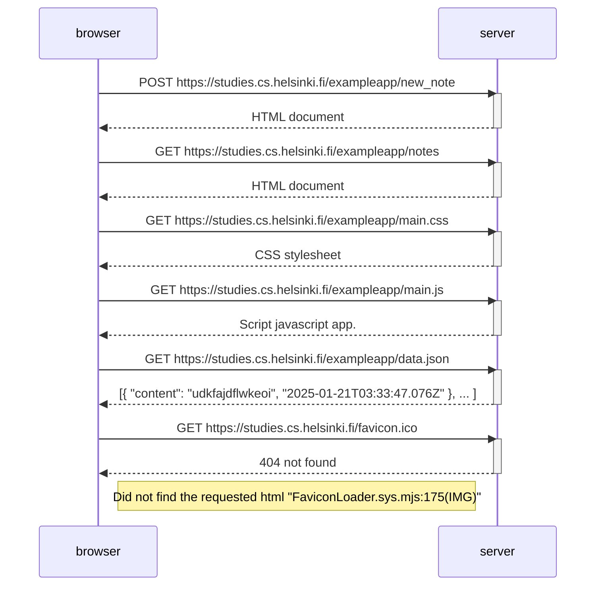
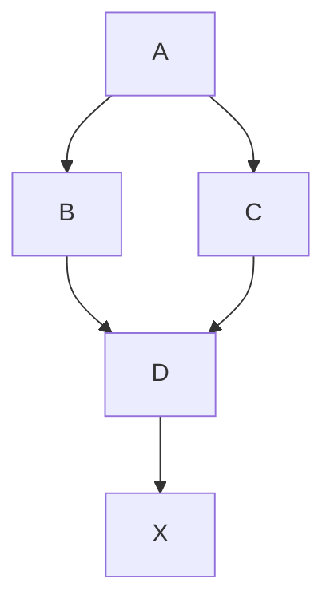

Excercise 0.4

```mermaid
    sequenceDiagram
        participant browser
        participant server

        browser->>server: POST https://studies.cs.helsinki.fi/exampleapp/new_note
        activate server
        server-->>browser: HTML document
        deactivate server

        browser->>server: GET https://studies.cs.helsinki.fi/exampleapp/notes
        activate server
        server-->>browser: HTML document
        deactivate server

        browser->>server: GET https://studies.cs.helsinki.fi/exampleapp/main.css
        activate server
        server-->>browser: CSS stylesheet
        deactivate server

        browser->>server: GET https://studies.cs.helsinki.fi/exampleapp/main.js
        activate server
        server-->>browser: Script javascript app.
        deactivate server

        browser->>server: GET https://studies.cs.helsinki.fi/exampleapp/data.json
        activate server
        server-->>browser: [{ "content": "udkfajdflwkeoi", "2025-01-21T03:33:47.076Z" }, ... ]
        deactivate server

        browser->>server: GET https://studies.cs.helsinki.fi/favicon.ico
        activate server
        server-->>browser: 404 not found
        deactivate server

        Note right of browser: Did not find the requested html "FaviconLoader.sys.mjs:175(IMG)"
```

```mermaid
graph TD;
    A-->B;
    A-->C;
    B-->D;
    C-->D;
    D-->X;
```