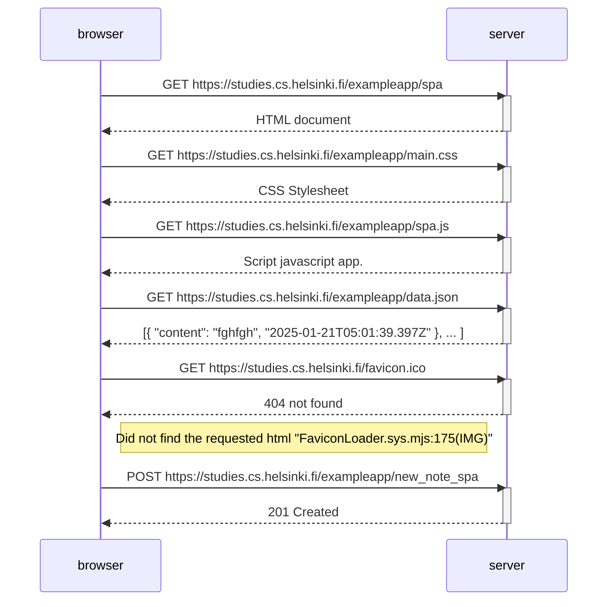

Excercise 0.5

```mermaid
    sequenceDiagram
        participant browser
        participant server

        browser->>server: GET https://studies.cs.helsinki.fi/exampleapp/spa
        activate server
        server-->>browser: HTML document
        deactivate server

        browser->>server: GET https://studies.cs.helsinki.fi/exampleapp/main.css
        activate server
        server-->>browser: CSS Stylesheet
        deactivate server

        browser->>server: GET https://studies.cs.helsinki.fi/exampleapp/spa.js
        activate server
        server-->>browser: Script javascript app.
        deactivate server

        browser->>server: GET https://studies.cs.helsinki.fi/exampleapp/data.json
        activate server
        server-->>browser: [{ "content": "fghfgh", "2025-01-21T05:01:39.397Z" }, ... ]
        deactivate server

        browser->>server: GET https://studies.cs.helsinki.fi/favicon.ico
        activate server
        server-->>browser: 404 not found
        deactivate server

        Note right of browser: Did not find the requested html "FaviconLoader.sys.mjs:175(IMG)"

        browser->>server: POST https://studies.cs.helsinki.fi/exampleapp/new_note_spa
        activate server
        server-->>browser: 201 Created 
        deactivate server

        
```